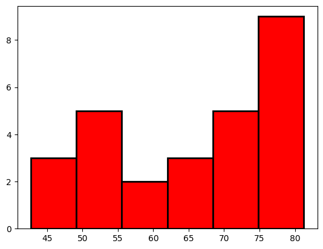

# Python Golden Notes

This Repo include Notes for 3 main libraries in Python used for **Data Science** & **Machine Learning**

- [numpy](#numpy)
- [matplotlib](#matplotlib)
- [pandas](#pandas)


# numpy
## np array boolean


```python
# Import numpy
import numpy as np

# Calculate the BMI: bmi
height_in = [74, 74, 72, 72, 73, 69, 69, 71, 76, 71]
weight_lb = [180, 215, 210, 210, 188, 176, 209, 200, 231, 180]

np_height_m = np.array(height_in) * 0.0254
np_weight_kg = np.array(weight_lb) * 0.453592
bmi = np_weight_kg / (np_height_m**2)

# Create the light array (boolean array)
light = bmi < 25
print(light)
# BMIs of all baseball players whose BMI is below 21
print(bmi[light])
```

    [ True False False False  True False False False False False]
    [23.11037639 24.80333518]


```python
import numpy as np

my_house = np.array([18.0, 20.0, 10.75, 9.50])
your_house = np.array([14.0, 24.0, 14.25, 9.0])

# my_house greater than or equal to 18
print(my_house>=18)

# my_house less than your_house
print(my_house<your_house)
```

    [ True  True False False]
    [False  True  True False]


## Logical operators
```np.logical_and()```

```np.logical_or()```

```np.logical_not()```


```python
# Create arrays
import numpy as np
my_house = np.array([18.0, 20.0, 10.75, 9.50])
your_house = np.array([14.0, 24.0, 14.25, 9.0])

# my_house greater than 18.5 or smaller than 10
print(np.logical_or(my_house>18.5,my_house<10))

# Both my_house and your_house smaller than 11
print(np.logical_and(my_house<11,your_house<11))
```

    [False  True False  True]
    [False False False  True]


## Know the number of rows and cols of np array


```python
baseball = [[180, 78.4], [215, 102.7], [210, 98.5], [188, 75.2]]

# Create a 2D numpy array from baseball: np_baseball
np_baseball = np.array(baseball)

# Print out the type of np_baseball
print(type(np_baseball))

# Print out the shape of np_baseball
print(np_baseball.shape)
```

    <class 'numpy.ndarray'>
    (4, 2)


## 2D Arithmetic


```python
# Import numpy package
import numpy as np

np_mat = np.array([[1, 2], [3, 4], [5, 6]])

# Create numpy array: conversion
# Multiply the first col by 2 & the second col by 3
conversion = np.array([2, 3])

# Print out product of np_baseball and conversion
print(np_mat * conversion)
```

    [[ 2  6]
     [ 6 12]
     [10 18]]


## Filtering np array


```python
import numpy as np

positions = ["GK", "M", "A", "D"]
heights = [191, 184, 185, 180]
# Convert positions and heights to numpy arrays: np_positions, np_heights
np_positions = np.array(positions)
np_heights = np.array(heights)

# Heights of the goalkeepers: gk_heights
gk_heights = np_heights[np_positions == "GK"]

# Heights of the other players: other_heights
other_heights = np_heights[np_positions != "GK"]

# Print out the median height of goalkeepers
print("Median height of goalkeepers: " + str(np.median(gk_heights)))

# Print out the median height of other players
print("Median height of other players: " + str(np.median(other_heights)))
```

    Median height of goalkeepers: 191.0
    Median height of other players: 184.0

# matplotlib

## Line Plot

#### Notes

`plt.clf()` to clear

```python
import matplotlib.pyplot as plt

year = [2000, 2010, 2020, 2030, 2040]
pop = [2000, 4000, 1000, 3000, 5000]

# Make a line plot: year on the x-axis, pop on the y-axis
plt.plot(year, pop)

# Customization
# ---------------------------------------------

plt.xlabel("Year")
plt.ylabel("Population")
plt.title("World Population Projections")
plt.yticks([0, 1000, 2000, 3000, 4000, 5000, 6000],[0,'1k','2k','3k','4k','5k','6k'])
plt.text(2010,50,"Text")
plt.grid(True)
plt.xlim(2000,None)
# ---------------------------------------------

# Display the plot with plt.show()
plt.show()
```


## Scatter Plot

#### Note

Use log scale

`plt.xscale('log')`

```python
import matplotlib.pyplot as plt

year = [2000, 2010, 2020, 2030, 2040]
pop = [20, 40, 10, 30, 50]

# Make a line plot: year on the x-axis, pop on the y-axis
plt.scatter(year, pop, color="red", marker="x")

# Display the plot with plt.show()
plt.show()
```


## Histogram

`plt.hist(list,bins)`

bins = 10 by default

```python
import matplotlib.pyplot as plt

x = [
    43.828,
    76.423,
    72.301,
    42.731,
    75.32,
    81.235,
    79.829,
    75.635,
    64.062,
    79.441,
    56.728,
    65.554,
    74.852,
    50.728,
    72.39,
    73.005,
    52.295,
    49.58,
    59.723,
    50.43,
    80.653,
    50.651,
    78.553,
    72.961,
    72.889,
    65.152,
    46.462,

]
plt.hist(x, bins=6, color="red", edgecolor="black", linewidth=2)
plt.show()
```



# pandas
## Dictionary to DataFrame


```python
# Pre-defined lists
names = ["United States", "Australia", "Japan", "India", "Russia", "Morocco", "Egypt"]
dr = [True, False, False, False, True, True, True]
cpc = [809, 731, 588, 18, 200, 70, 45]

# Import pandas as pd
import pandas as pd

# Create dictionary my_dict with three key:value pairs: my_dict
my_dict = {"country": names, "drives_right": dr, "cars_per_cap": cpc}

# Build a DataFrame cars from my_dict: cars
cars = pd.DataFrame(my_dict)

# Definition of row_labels
row_labels = ["US", "AUS", "JPN", "IN", "RU", "MOR", "EG"]

# Specify row labels of cars
cars.index = row_labels

# Print cars
print(cars)
```

## CSV to DataFrame


```python
# Import pandas as pd
import pandas as pd

# Fix import by including index_col
cars = pd.read_csv("datasets/cars.csv")
# Print out cars
print(cars)
print("----------------------------------------------")
# Specify the index_col argument inside pd.read_csv(): set it to 0, so that the first column is used as row labels.
cars2 = pd.read_csv("datasets/cars.csv", index_col=0)
print(cars2)
```

## Col access using brackets


```python
import pandas as pd

cars = pd.read_csv("datasets/cars.csv", index_col=0)

print(cars)
print("----------------------------------------------")
print(cars[["country", "drives_right"]])
print("----------------------------------------------")
print(cars[["country"]])
print("----------------------------------------------")
```

## Row access using brackets


```python
import pandas as pd

cars = pd.read_csv("datasets/cars.csv", index_col=0)

print(cars)
print("----------------------------------------------")
print(cars[1:4])
print("----------------------------------------------")
```

## Rows & Cols access using `loc` & `iloc`

`[Subsetting DataFrame]`


```python
import pandas as pd

cars = pd.read_csv("datasets/cars.csv", index_col=0)

print(cars)
print("----------------------------------------------")


# Access row by label
print(cars.loc[["RU"]])
print("----------------------------------------------")
print(cars.iloc[[4]])
print("----------------------------------------------")

# print as series
print(cars.loc["RU"])
print("----------------------------------------------")

# print as dataframe
print(cars.loc[["RU"]])
print("----------------------------------------------")


# Access multiple rows by label
print(cars.loc[["RU", "IN", "EG"]])
print("----------------------------------------------")
print(cars.iloc[[4, 3, 6]])
print("----------------------------------------------")


# Access row and column by label
print(cars.loc[["RU", "IN", "EG"], ["country", "drives_right"]])
print("----------------------------------------------")
print(cars.iloc[[4, 3, 6], [1, 2]])
print("----------------------------------------------")


# All rows, some columns
print(cars.loc[:, ["country", "drives_right"]])
print("----------------------------------------------")
print(cars.iloc[:, [1, 2]])
print("----------------------------------------------")


# specific cell
print(cars.loc[["RU"], ["country"]])
print("----------------------------------------------")

# Sub-dataframe
print(cars.loc[["RU", "IN", "EG"], ["country", "drives_right"]])
print("----------------------------------------------")
```

## Filtering from dataframe based on a condition


```python
# Import cars data
import pandas as pd

cars = pd.read_csv("datasets/cars.csv", index_col=0)

# Extract drives_right column as Series: dr
dr = cars["drives_right"]
print(dr)
print("----------------------------------------------")

# Use dr to subset cars: sel
sel = dr == True

# Print sel
print(cars[sel])
```


```python
# Import cars data
import pandas as pd

cars = pd.read_csv("datasets/cars.csv", index_col=0)

# Create car_maniac: observations that have a cars_per_cap over 500
cpc = cars["cars_per_cap"]
many_cars = cpc > 500
car_maniac = cars[many_cars]

# Print car_maniac
print(car_maniac)
```


```python
# Import cars data
import pandas as pd

cars = pd.read_csv("datasets/cars.csv", index_col=0)

# Import numpy, you'll need this
import numpy as np

# Create medium: observations with cars_per_cap between 100 and 500
cpc = cars["cars_per_cap"]
between = np.logical_and(cpc > 100, cpc < 500)
medium = cars[between]

# Print medium
print(medium)
```

## Iterate over a dataframe


```python
# Import cars data
import pandas as pd

cars = pd.read_csv("datasets/cars.csv", index_col=0)

# Iterate over rows of cars
for label, row in cars.iterrows():
    print(label)
    print(row)
```


```python
# Import cars data
import pandas as pd

cars = pd.read_csv("datasets/cars.csv", index_col=0)

# Adapt for loop
for lab, row in cars.iterrows():
    print(f"{lab}: {row['cars_per_cap']}")
```

## Add column using `loc`


```python
# Import cars data
import pandas as pd

cars = pd.read_csv("datasets/cars.csv", index_col=0)
print(cars)
print("----------------------------------------------")
# Code for loop that adds COUNTRY column
for label, row in cars.iterrows():
    cars.loc[label, "COUNTRY"] = row["country"].upper()

# Print cars
print(cars)
```

## Add column using `apply()`


```python
# Import cars data
import pandas as pd

cars = pd.read_csv("datasets/cars.csv", index_col=0)
print(cars)
print("----------------------------------------------")
# Use .apply(str.upper) beacuse .upper() is a method
cars["COUNTRY"] = cars["country"].apply(str.upper)
# use .apply(len) because len() is a function
cars["country length"] = cars["country"].apply(len)

print(cars)
```
