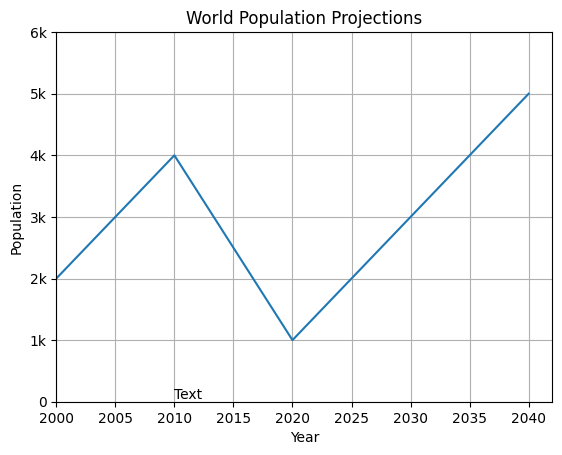

# Python Golden Notes

This is my Python Notes Repo
This Repo include Notes for 3 main libraries in Python used for **Data Science** & **Machine Learning**

- [numpy](#numpy)
- [matplotlib](#matplotlib)
- [pandas](#pandas)

# numpy

# matplotlib

## Line Plot

#### Notes

`plt.clf()` to clear

```python
import matplotlib.pyplot as plt

year = [2000, 2010, 2020, 2030, 2040]
pop = [2000, 4000, 1000, 3000, 5000]

# Make a line plot: year on the x-axis, pop on the y-axis
plt.plot(year, pop)

# Customization
# ---------------------------------------------

plt.xlabel("Year")
plt.ylabel("Population")
plt.title("World Population Projections")
plt.yticks([0, 1000, 2000, 3000, 4000, 5000, 6000],[0,'1k','2k','3k','4k','5k','6k'])
plt.text(2010,50,"Text")
plt.grid(True)
plt.xlim(2000,None)
# ---------------------------------------------

# Display the plot with plt.show()
plt.show()
```



## Scatter Plot

#### Note

Use log scale

`plt.xscale('log')`

```python
import matplotlib.pyplot as plt

year = [2000, 2010, 2020, 2030, 2040]
pop = [20, 40, 10, 30, 50]

# Make a line plot: year on the x-axis, pop on the y-axis
plt.scatter(year, pop, color="red", marker="x")

# Display the plot with plt.show()
plt.show()
```


## Histogram

`plt.hist(list,bins)`

bins = 10 by default

```python
import matplotlib.pyplot as plt

x = [
    43.828,
    76.423,
    72.301,
    42.731,
    75.32,
    81.235,
    79.829,
    75.635,
    64.062,
    79.441,
    56.728,
    65.554,
    74.852,
    50.728,
    72.39,
    73.005,
    52.295,
    49.58,
    59.723,
    50.43,
    80.653,
    50.651,
    78.553,
    72.961,
    72.889,
    65.152,
    46.462,

]
plt.hist(x, bins=6, color="red", edgecolor="black", linewidth=2)
plt.show()
```


# pandas
